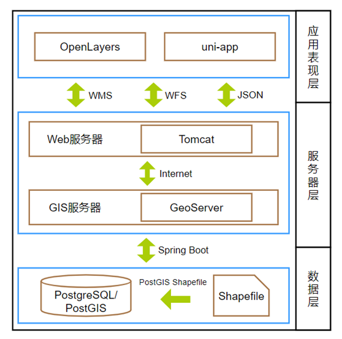
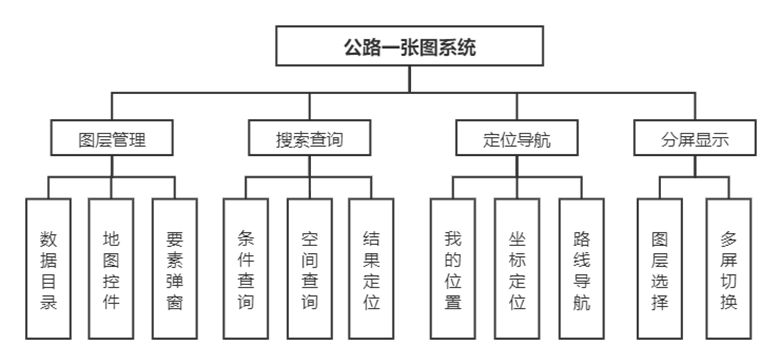
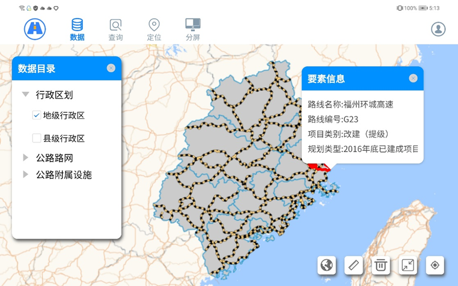
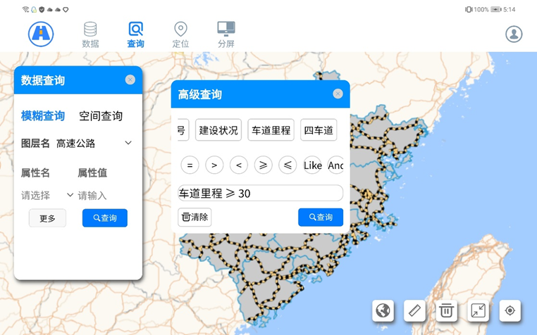
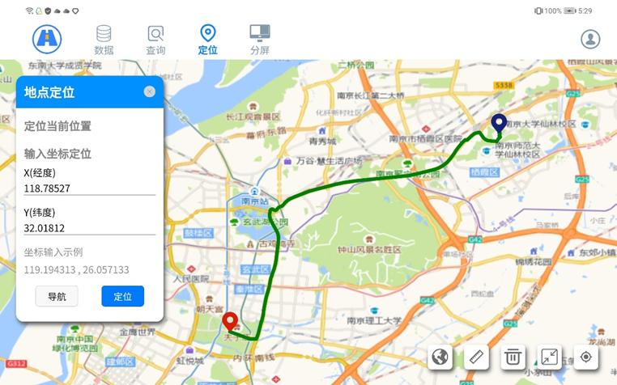
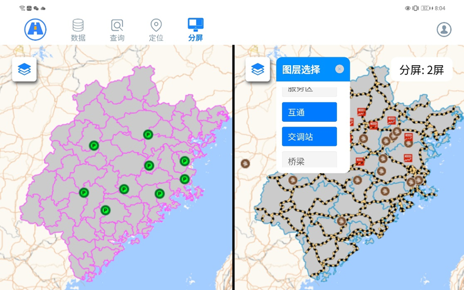

# onemap

## 项目介绍

项目选择OpenLayers为前端地图库、GeoServer为地图服务器、PostgreSQL与PostGIS为数据库的开源GIS体系结构，基于uni-app跨平台开发框架设计并实现交通移动一张图原型系统。

## 系统架构

## 技术实现

> [*uniapp加载openlayers——组件通信篇（重要）](https://chance7bin.github.io/posts/map/uniapp%E5%8A%A0%E8%BD%BDopenlayers%E7%BB%84%E4%BB%B6%E9%80%9A%E4%BF%A1%E7%AF%87/)
>
> [*openlayers加载地图服务（重要）](https://chance7bin.github.io/posts/map/openlayers%E5%8A%A0%E8%BD%BD%E5%9C%B0%E5%9B%BE%E6%9C%8D%E5%8A%A1/)
>
> [openlayers对要素服务的增删改查](https://chance7bin.github.io/posts/map/openlayers%E5%AF%B9%E8%A6%81%E7%B4%A0%E6%9C%8D%E5%8A%A1%E7%9A%84%E5%A2%9E%E5%88%A0%E6%94%B9%E6%9F%A5/)
>
> [openlayers uniapp 移动端开发问题汇总](https://chance7bin.github.io/posts/map/openlayers-uniapp-%E7%A7%BB%E5%8A%A8%E7%AB%AF%E5%BC%80%E5%8F%91%E9%97%AE%E9%A2%98%E6%B1%87%E6%80%BB/)
>
> [openlayers wms点击查询报错](https://chance7bin.github.io/posts/map/openlayers-wms%E7%82%B9%E5%87%BB%E6%9F%A5%E8%AF%A2%E6%8A%A5%E9%94%99/)
>
> [uniapp加载mapbox并发布成小程序](https://chance7bin.github.io/posts/map/uniapp%E5%8A%A0%E8%BD%BDmapbox%E5%B9%B6%E5%8F%91%E5%B8%83%E6%88%90%E5%B0%8F%E7%A8%8B%E5%BA%8F/)
>
> [移动端的地图开发](https://chance7bin.github.io/posts/map/%E7%A7%BB%E5%8A%A8%E7%AB%AF%E7%9A%84%E5%9C%B0%E5%9B%BE%E5%BC%80%E5%8F%91/)
>
> [参考资料](https://chance7bin.github.io/posts/map/%E5%8F%82%E8%80%83%E8%B5%84%E6%96%99/)

## 系统功能

## 功能截图

 

 

 

 
